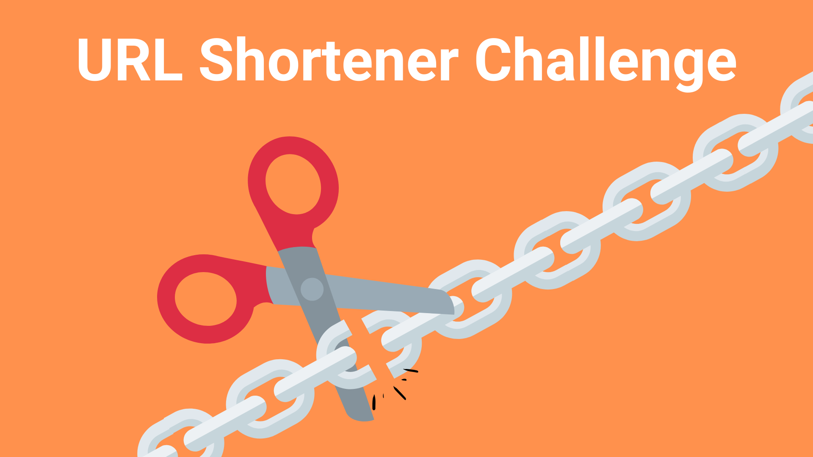

<h1 align="center">
  :scissors::link: URL Shortener
</h1>

  
  
  

  

  
  
  

  
  
  

  <a href="#rocket-tecnologias">Tecnologias</a>&nbsp;&nbsp;&nbsp;|&nbsp;&nbsp;&nbsp;
  <a href="#-projeto">Projeto</a>&nbsp;&nbsp;&nbsp;|&nbsp;&nbsp;&nbsp;
  <a href="#-como-contribuir">Como contribuir</a>&nbsp;&nbsp;&nbsp;|&nbsp;&nbsp;&nbsp;
  <a href="#arrow_forward-como-rodar">Como rodar</a>&nbsp;&nbsp;&nbsp;|&nbsp;&nbsp;&nbsp;
  <a href="#memo-licença">Licença</a>

 

  

## :rocket: Tecnologias

Esse projeto foi desenvolvido com as seguintes tecnologias:

- [Node.js](https://nodejs.org/en/)
- [Typescript](https://www.typescriptlang.org/)
- [MongoDB](https://docs.mongodb.com/)

## 💻 Projeto

Esse projeto é uma API REST desenvolvida, com [Node.js](https://nodejs.org/en/) e [Typescript](https://www.typescriptlang.org/), baseada em um [desafio de backend](https://github.com/backend-br/desafios/tree/master/1%20-%20Easy/Encurtador%20de%20URL) do [Backend-Br](https://github.com/backend-br). O intuito do desafio foi criar um serviço que inicialmente recebe como parâmetro uma URL que deverá ser encurtada seguindo as seguintes regras:

1. Mínimo de 5 e máximo de 10 caracteres.

2. Apenas letras e números.

A url retornada deve ser salva no banco de dados e possuir um prazo de validade e ao receber uma url encurtada, deve fazer o redirecionamento para a url salva no banco. Nesse projeto usei o [MongoDB](https://docs.mongodb.com/) como banco de dados.

## 🤔 Como contribuir

- Adicione uma :star: estrela nesse projeto :smile:;
- Faça um fork desse repositório;
- Cria uma branch com a sua feature: `git checkout -b minha-feature`;
- Faça commit das suas alterações: `git commit -m 'feat: Minha nova feature'`;
- Faça push para a sua branch: `git push origin minha-feature`.

Depois que o merge da sua pull request for feito, você pode deletar a sua branch.

## :arrow_forward: Como rodar

- No seu terminal, rode o comando para instalar as dependências do projeto: `yarn`;
- Crie uma cópia do arquivo **.env.example** com o nome **.env** (na raiz) e defina suas variáveis de ambiente;
- Rode o comando para iniciar o servidor (em modo desenvolvimento): `yarn start:dev`;

Se tudo ocorrer bem, a aplicação vai estar disponível em: **http://localhost:3333**.

## :memo: Licença

Esse projeto está sob a licença MIT. Veja o arquivo [LICENSE](LICENSE.md) para mais detalhes.

---

Feito com ♥ by [Danilo Gonçalves](https://github.com/goncadanilo). Me adicione no [LinkedIn](https://www.linkedin.com/in/goncadanilo/) :wave:
